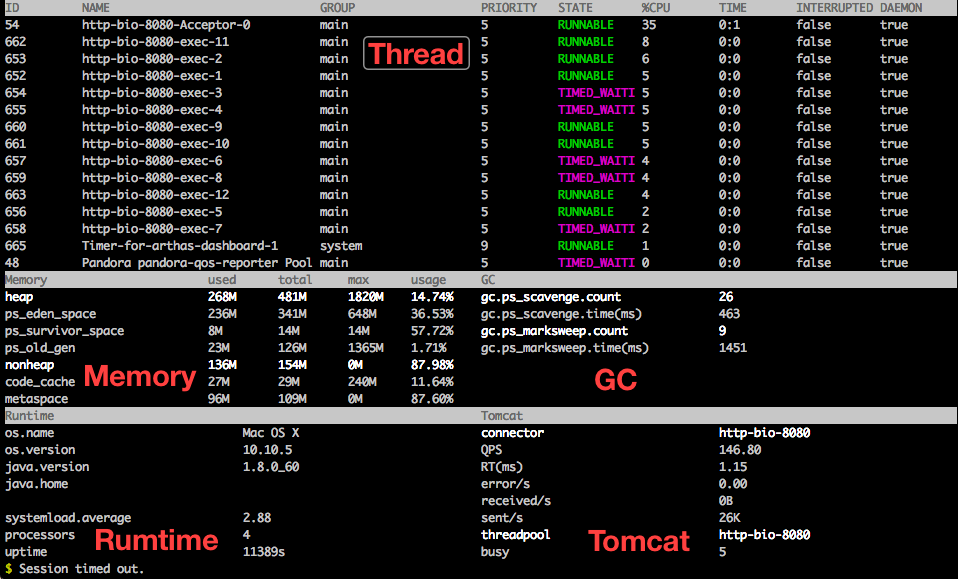
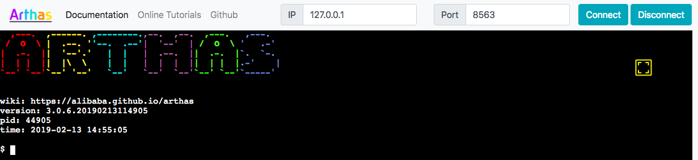

## Arthas


[](https://travis-ci.org/alibaba/arthas)
[](https://codecov.io/gh/alibaba/arthas)
[](https://search.maven.org/search?q=g:com.taobao.arthas)

[](http://isitmaintained.com/project/alibaba/arthas "Average time to resolve an issue")
[](http://isitmaintained.com/project/alibaba/arthas "Percentage of issues still open")

English version goes [here](README.md).

`Arthas` 是Alibaba开源的Java诊断工具，深受开发者喜爱。

当你遇到以下类似问题而束手无策时，`Arthas`可以帮助你解决：

0. 这个类从哪个 jar 包加载的？为什么会报各种类相关的 Exception？
0. 我改的代码为什么没有执行到？难道是我没 commit？分支搞错了？
0. 遇到问题无法在线上 debug，难道只能通过加日志再重新发布吗？
0. 线上遇到某个用户的数据处理有问题，但线上同样无法 debug，线下无法重现！
0. 是否有一个全局视角来查看系统的运行状况？
0. 有什么办法可以监控到JVM的实时运行状态？
0. 怎么快速定位应用的热点，生成火焰图？
0. 怎样直接从JVM内查找某个类的实例？

`Arthas`支持JDK 6+，支持Linux/Mac/Windows，采用命令行交互模式，同时提供丰富的 `Tab` 自动补全功能，进一步方便进行问题的定位和诊断。


### [在线教程(推荐)](https://arthas.aliyun.com/doc/arthas-tutorials.html?language=cn)

* [使用方法](tutorials/katacoda/README_CN.md#在线教程使用方法)

### 快速开始

#### 使用`arthas-boot`(推荐)

下载`arthas-boot.jar`，然后用`java -jar`的方式启动：

```bash
curl -O https://arthas.aliyun.com/arthas-boot.jar
java -jar arthas-boot.jar
```

打印帮助信息：

```bash
java -jar arthas-boot.jar -h
```

* 如果下载速度比较慢，可以使用aliyun的镜像：`java -jar arthas-boot.jar --repo-mirror aliyun --use-http`

#### 使用`as.sh`

Arthas 支持在 Linux/Unix/Mac 等平台上一键安装，请复制以下内容，并粘贴到命令行中，敲 `回车` 执行即可：

```bash
curl -L https://arthas.aliyun.com/install.sh | sh
```

上述命令会下载启动脚本文件 `as.sh` 到当前目录，你可以放在任何地方或将其加入到 `$PATH` 中。

直接在shell下面执行`./as.sh`，就会进入交互界面。

也可以执行`./as.sh -h`来获取更多参数信息。

### 文档

* [在线教程(推荐)](https://arthas.aliyun.com/doc/arthas-tutorials.html?language=cn)
* [用户文档](https://arthas.aliyun.com/doc/)
* [安装](https://arthas.aliyun.com/doc/install-detail.html)
* [下载](https://arthas.aliyun.com/doc/download.html)
* [快速入门](https://arthas.aliyun.com/doc/quick-start.html)
* [进阶使用](https://arthas.aliyun.com/doc/advanced-use.html)
* [命令列表](https://arthas.aliyun.com/doc/commands.html)
* [WebConsole](https://arthas.aliyun.com/doc/web-console.html)
* [Docker](https://arthas.aliyun.com/doc/docker.html)
* [Arthas Spring Boot Starter](https://arthas.aliyun.com/doc/spring-boot-starter.html)
* [用户案例](https://github.com/alibaba/arthas/issues?q=label%3Auser-case)
* [FAQ/常见问题](https://arthas.aliyun.com/doc/faq)
* [编译调试/参与贡献](https://github.com/alibaba/arthas/blob/master/CONTRIBUTING.md)
* [Release Notes](https://github.com/alibaba/arthas/releases)
* [QQ群/钉钉群](https://arthas.aliyun.com/doc/contact-us.html)

### 案例展示

#### Dashboard

* https://arthas.aliyun.com/doc/dashboard



#### Thread

* https://arthas.aliyun.com/doc/thread

一目了然的了解系统的状态，哪些线程比较占cpu？他们到底在做什么？

```
$ thread -n 3
"as-command-execute-daemon" Id=29 cpuUsage=75% RUNNABLE
    at sun.management.ThreadImpl.dumpThreads0(Native Method)
    at sun.management.ThreadImpl.getThreadInfo(ThreadImpl.java:440)
    at com.taobao.arthas.core.command.monitor200.ThreadCommand$1.action(ThreadCommand.java:58)
    at com.taobao.arthas.core.command.handler.AbstractCommandHandler.execute(AbstractCommandHandler.java:238)
    at com.taobao.arthas.core.command.handler.DefaultCommandHandler.handleCommand(DefaultCommandHandler.java:67)
    at com.taobao.arthas.core.server.ArthasServer$4.run(ArthasServer.java:276)
    at java.util.concurrent.ThreadPoolExecutor.runWorker(ThreadPoolExecutor.java:1145)
    at java.util.concurrent.ThreadPoolExecutor$Worker.run(ThreadPoolExecutor.java:615)
    at java.lang.Thread.run(Thread.java:745)

    Number of locked synchronizers = 1
    - java.util.concurrent.ThreadPoolExecutor$Worker@6cd0b6f8

"as-session-expire-daemon" Id=25 cpuUsage=24% TIMED_WAITING
    at java.lang.Thread.sleep(Native Method)
    at com.taobao.arthas.core.server.DefaultSessionManager$2.run(DefaultSessionManager.java:85)

"Reference Handler" Id=2 cpuUsage=0% WAITING on java.lang.ref.Reference$Lock@69ba0f27
    at java.lang.Object.wait(Native Method)
    -  waiting on java.lang.ref.Reference$Lock@69ba0f27
    at java.lang.Object.wait(Object.java:503)
    at java.lang.ref.Reference$ReferenceHandler.run(Reference.java:133)
```

#### jad

* https://arthas.aliyun.com/doc/jad

对类进行反编译:

```java
$ jad javax.servlet.Servlet

ClassLoader:
+-java.net.URLClassLoader@6108b2d7
  +-sun.misc.Launcher$AppClassLoader@18b4aac2
    +-sun.misc.Launcher$ExtClassLoader@1ddf84b8

Location:
/Users/xxx/work/test/lib/servlet-api.jar

/*
 * Decompiled with CFR 0_122.
 */
package javax.servlet;

import java.io.IOException;
import javax.servlet.ServletConfig;
import javax.servlet.ServletException;
import javax.servlet.ServletRequest;
import javax.servlet.ServletResponse;

public interface Servlet {
    public void init(ServletConfig var1) throws ServletException;

    public ServletConfig getServletConfig();

    public void service(ServletRequest var1, ServletResponse var2) throws ServletException, IOException;

    public String getServletInfo();

    public void destroy();
}
```

#### mc
* https://arthas.aliyun.com/doc/mc

Memory Compiler/内存编译器，编译`.java`文件生成`.class`。

```bash
mc /tmp/Test.java
```

#### retransform
* https://arthas.aliyun.com/doc/rretransform

加载外部的`.class`文件，retransform 热更新jvm已加载的类。

```bash
retransform /tmp/Test.class
retransform -c 327a647b /tmp/Test.class /tmp/Test\$Inner.class
```

#### sc
* https://arthas.aliyun.com/doc/sc

查找JVM中已经加载的类

```bash
$ sc -d org.springframework.web.context.support.XmlWebApplicationContext
 class-info        org.springframework.web.context.support.XmlWebApplicationContext
 code-source       /Users/xxx/work/test/WEB-INF/lib/spring-web-3.2.11.RELEASE.jar
 name              org.springframework.web.context.support.XmlWebApplicationContext
 isInterface       false
 isAnnotation      false
 isEnum            false
 isAnonymousClass  false
 isArray           false
 isLocalClass      false
 isMemberClass     false
 isPrimitive       false
 isSynthetic       false
 simple-name       XmlWebApplicationContext
 modifier          public
 annotation
 interfaces
 super-class       +-org.springframework.web.context.support.AbstractRefreshableWebApplicationContext
                     +-org.springframework.context.support.AbstractRefreshableConfigApplicationContext
                       +-org.springframework.context.support.AbstractRefreshableApplicationContext
                         +-org.springframework.context.support.AbstractApplicationContext
                           +-org.springframework.core.io.DefaultResourceLoader
                             +-java.lang.Object
 class-loader      +-org.apache.catalina.loader.ParallelWebappClassLoader
                     +-java.net.URLClassLoader@6108b2d7
                       +-sun.misc.Launcher$AppClassLoader@18b4aac2
                         +-sun.misc.Launcher$ExtClassLoader@1ddf84b8
 classLoaderHash   25131501

```

#### vmtool

* https://arthas.aliyun.com/doc/vmtool

从JVM heap中获取指定类的实例。

```bash
$ vmtool --action getInstances --className java.lang.String --limit 10
@String[][
    @String[com/taobao/arthas/core/shell/session/Session],
    @String[com.taobao.arthas.core.shell.session.Session],
    @String[com/taobao/arthas/core/shell/session/Session],
    @String[com/taobao/arthas/core/shell/session/Session],
    @String[com/taobao/arthas/core/shell/session/Session.class],
    @String[com/taobao/arthas/core/shell/session/Session.class],
    @String[com/taobao/arthas/core/shell/session/Session.class],
    @String[com/],
    @String[java/util/concurrent/ConcurrentHashMap$ValueIterator],
    @String[java/util/concurrent/locks/LockSupport],
]
```
#### stack

* https://arthas.aliyun.com/doc/stack

查看方法 `test.arthas.TestStack#doGet` 的调用堆栈：

```bash
$ stack test.arthas.TestStack doGet
Press Ctrl+C to abort.
Affect(class-cnt:1 , method-cnt:1) cost in 286 ms.
ts=2018-09-18 10:11:45;thread_name=http-bio-8080-exec-10;id=d9;is_daemon=true;priority=5;TCCL=org.apache.catalina.loader.ParallelWebappClassLoader@25131501
    @test.arthas.TestStack.doGet()
        at javax.servlet.http.HttpServlet.service(HttpServlet.java:624)
        at javax.servlet.http.HttpServlet.service(HttpServlet.java:731)
        at org.apache.catalina.core.ApplicationFilterChain.internalDoFilter(ApplicationFilterChain.java:303)
        at org.apache.catalina.core.ApplicationFilterChain.doFilter(ApplicationFilterChain.java:208)
        at org.apache.tomcat.websocket.server.WsFilter.doFilter(WsFilter.java:52)
        at org.apache.catalina.core.ApplicationFilterChain.internalDoFilter(ApplicationFilterChain.java:241)
        at org.apache.catalina.core.ApplicationFilterChain.doFilter(ApplicationFilterChain.java:208)
        at org.apache.catalina.core.ApplicationFilterChain.internalDoFilter(ApplicationFilterChain.java:241)
        at org.apache.catalina.core.ApplicationFilterChain.doFilter(ApplicationFilterChain.java:208)
        at org.apache.catalina.core.StandardWrapperValve.invoke(StandardWrapperValve.java:220)
        at org.apache.catalina.core.StandardContextValve.invoke(StandardContextValve.java:110)
        ...
        at org.apache.catalina.core.StandardHostValve.invoke(StandardHostValve.java:169)
        at org.apache.catalina.valves.ErrorReportValve.invoke(ErrorReportValve.java:103)
        at org.apache.catalina.core.StandardEngineValve.invoke(StandardEngineValve.java:116)
        at org.apache.catalina.connector.CoyoteAdapter.service(CoyoteAdapter.java:451)
        at org.apache.coyote.http11.AbstractHttp11Processor.process(AbstractHttp11Processor.java:1121)
        at org.apache.coyote.AbstractProtocol$AbstractConnectionHandler.process(AbstractProtocol.java:637)
        at org.apache.tomcat.util.net.JIoEndpoint$SocketProcessor.run(JIoEndpoint.java:316)
        at java.util.concurrent.ThreadPoolExecutor.runWorker(ThreadPoolExecutor.java:1142)
        at java.util.concurrent.ThreadPoolExecutor$Worker.run(ThreadPoolExecutor.java:617)
        at org.apache.tomcat.util.threads.TaskThread$WrappingRunnable.run(TaskThread.java:61)
        at java.lang.Thread.run(Thread.java:745)
```

#### Trace

* https://arthas.aliyun.com/doc/trace

观察方法执行的时候哪个子调用比较慢:


#### Watch

* https://arthas.aliyun.com/doc/watch

观察方法 `test.arthas.TestWatch#doGet` 执行的入参，仅当方法抛出异常时才输出。

```bash
$ watch test.arthas.TestWatch doGet {params[0], throwExp} -e
Press Ctrl+C to abort.
Affect(class-cnt:1 , method-cnt:1) cost in 65 ms.
ts=2018-09-18 10:26:28;result=@ArrayList[
    @RequestFacade[org.apache.catalina.connector.RequestFacade@79f922b2],
    @NullPointerException[java.lang.NullPointerException],
]
```

#### Monitor

* https://arthas.aliyun.com/doc/monitor

监控某个特殊方法的调用统计数据，包括总调用次数，平均rt，成功率等信息，每隔5秒输出一次。


```bash
$ monitor -c 5 org.apache.dubbo.demo.provider.DemoServiceImpl sayHello
Press Ctrl+C to abort.
Affect(class-cnt:1 , method-cnt:1) cost in 109 ms.
 timestamp            class                                           method    total  success  fail  avg-rt(ms)  fail-rate
----------------------------------------------------------------------------------------------------------------------------
 2018-09-20 09:45:32  org.apache.dubbo.demo.provider.DemoServiceImpl  sayHello  5      5        0     0.67        0.00%

 timestamp            class                                           method    total  success  fail  avg-rt(ms)  fail-rate
----------------------------------------------------------------------------------------------------------------------------
 2018-09-20 09:45:37  org.apache.dubbo.demo.provider.DemoServiceImpl  sayHello  5      5        0     1.00        0.00%

 timestamp            class                                           method    total  success  fail  avg-rt(ms)  fail-rate
----------------------------------------------------------------------------------------------------------------------------
 2018-09-20 09:45:42  org.apache.dubbo.demo.provider.DemoServiceImpl  sayHello  5      5        0     0.43        0.00%
```

#### Time Tunnel(tt)

* https://arthas.aliyun.com/doc/tt

记录方法调用信息，支持事后查看方法调用的参数，返回值，抛出的异常等信息，仿佛穿越时空隧道回到调用现场一般。

```bash
$ tt -t org.apache.dubbo.demo.provider.DemoServiceImpl sayHello
Press Ctrl+C to abort.
Affect(class-cnt:1 , method-cnt:1) cost in 75 ms.
 INDEX   TIMESTAMP            COST(ms)  IS-RET  IS-EXP   OBJECT         CLASS                          METHOD
-------------------------------------------------------------------------------------------------------------------------------------
 1000    2018-09-20 09:54:10  1.971195  true    false    0x55965cca     DemoServiceImpl                sayHello
 1001    2018-09-20 09:54:11  0.215685  true    false    0x55965cca     DemoServiceImpl                sayHello
 1002    2018-09-20 09:54:12  0.236303  true    false    0x55965cca     DemoServiceImpl                sayHello
 1003    2018-09-20 09:54:13  0.159598  true    false    0x55965cca     DemoServiceImpl                sayHello
 1004    2018-09-20 09:54:14  0.201982  true    false    0x55965cca     DemoServiceImpl                sayHello
 1005    2018-09-20 09:54:15  0.214205  true    false    0x55965cca     DemoServiceImpl                sayHello
 1006    2018-09-20 09:54:16  0.241863  true    false    0x55965cca     DemoServiceImpl                sayHello
 1007    2018-09-20 09:54:17  0.305747  true    false    0x55965cca     DemoServiceImpl                sayHello
 1008    2018-09-20 09:54:18  0.18468   true    false    0x55965cca     DemoServiceImpl                sayHello
```

#### Classloader

* https://arthas.aliyun.com/doc/classloader

了解当前系统中有多少类加载器，以及每个加载器加载的类数量，帮助您判断是否有类加载器泄露。

```bash
$ classloader
 name                                                  numberOfInstances  loadedCountTotal
 BootstrapClassLoader                                  1                  3346
 com.taobao.arthas.agent.ArthasClassloader             1                  1262
 java.net.URLClassLoader                               2                  1033
 org.apache.catalina.loader.ParallelWebappClassLoader  1                  628
 sun.reflect.DelegatingClassLoader                     166                166
 sun.misc.Launcher$AppClassLoader                      1                  31
 com.alibaba.fastjson.util.ASMClassLoader              6                  15
 sun.misc.Launcher$ExtClassLoader                      1                  7
 org.jvnet.hk2.internal.DelegatingClassLoader          2                  2
 sun.reflect.misc.MethodUtil                           1                  1
```

#### Web Console

* https://arthas.aliyun.com/doc/web-console



#### Profiler/FlameGraph/火焰图

* https://arthas.aliyun.com/doc/profiler

```bash
$ profiler start
Started [cpu] profiling
```

```
$ profiler stop
profiler output file: /tmp/demo/arthas-output/20191125-135546.svg
OK
```

通过浏览器查看profiler结果：


#### Arthas Spring Boot Starter

* [Arthas Spring Boot Starter](https://arthas.aliyun.com/doc/spring-boot-starter.html)

### Known Users

Arthas有超过120家登记用户，[查看全部](USERS.md)。

如果您在使用Arthas，请让我们知道，您的使用对我们非常重要：https://github.com/alibaba/arthas/issues/111 （按登记顺序排列）


### 衍生项目

* [Bistoury: 一个集成了Arthas的项目](https://github.com/qunarcorp/bistoury)
* [一个使用MVEL脚本的fork](https://github.com/XhinLiang/arthas)


### Credit

#### Contributors

感谢所有Contributors!

<a href="https://github.com/alibaba/arthas/graphs/contributors"></a>

#### Projects

* [bytekit](https://github.com/alibaba/bytekit) Java Bytecode Kit，Arthas里字节码增强的内核。
* [greys-anatomy](https://github.com/oldmanpushcart/greys-anatomy): Arthas代码基于Greys二次开发而来，非常感谢Greys之前所有的工作，以及Greys原作者对Arthas提出的意见和建议！
* [termd](https://github.com/alibaba/termd): Arthas的命令行实现基于termd开发，是一款优秀的命令行程序开发框架，感谢termd提供了优秀的框架。
* [crash](https://github.com/crashub/crash): Arthas的文本渲染功能基于crash中的文本渲染功能开发，可以从[这里](https://github.com/crashub/crash/tree/1.3.2/shell)看到源码，感谢crash在这方面所做的优秀工作。
* [cli](https://github.com/alibaba/cli): Arthas的命令行界面基于vert.x提供的cli库进行开发，感谢vert.x在这方面做的优秀工作。
* [compiler](https://github.com/skalogs/SkaETL/tree/master/compiler) Arthas里的内存编译器代码来源
* [Apache Commons Net](https://commons.apache.org/proper/commons-net/) Arthas里的Telnet Client代码来源
* [async-profiler](https://github.com/jvm-profiling-tools/async-profiler) Arthas's profiler 命令.

### 仓库镜像

* [码云Arthas](https://gitee.com/arthas/arthas)
