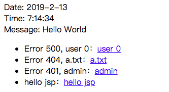

Download `demo-arthas-spring-boot.jar` - [[Source]](https://github.com/hengyunabc/spring-boot-inside/tree/master/demo-arthas-spring-boot), and start with `java -jar` command:

`wget https://github.com/hengyunabc/spring-boot-inside/raw/master/demo-arthas-spring-boot/demo-arthas-spring-boot.jar; java -jar demo-arthas-spring-boot.jar`{{execute T1}}

`demo-arthas-spring-boot` is a simple Spring Boot demo.

After booting, access port 80: {{TRAFFIC_HOST1_80}}

