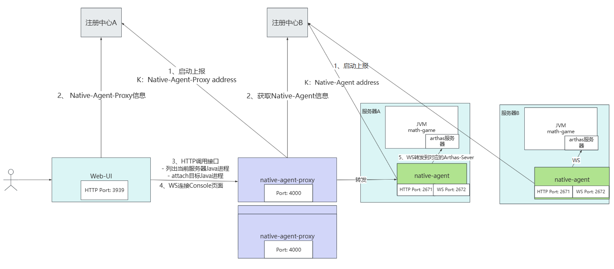
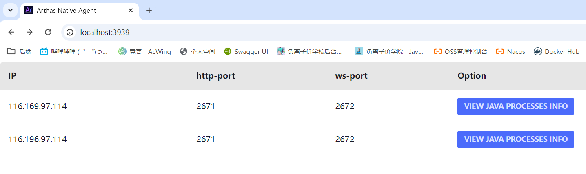
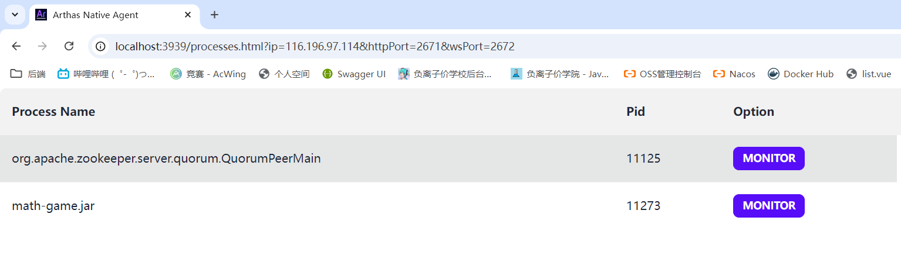
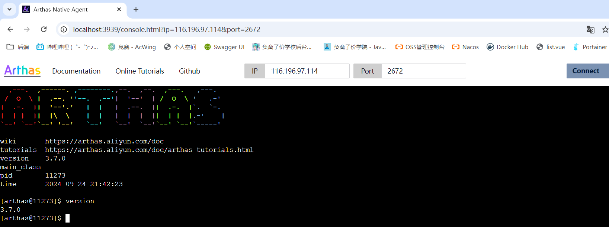

## Arthas Native Agent - 集群管理
 


# 快速开始

## 启动native-agent
native-agent，启动在需要动态attach的服务器上
启动参数

| 参数                   | 必填  | 解释                                  |
|----------------------|-----|-------------------------------------|
| http-port            | N   | http端口 ，默认2671                      |
| ws-port              | N   | ws端口，默认2672                         |
| registration-typ     | Y   | 注册中心类型（目前实现的有etcd和zookeeper,推荐etcd） |
| registration-address | Y   | 注册中心的地址                             |

example：
```shell
java -jar native-agent.jar --ip 164.196.97.123 --http-port 2671 --ws-port 2672 --registration-type etcd --registration-address 164.196.97.123:2379
```

## 启动native-agent-proxy
做为native-agent和native-agent-management-web的网络中转

| 参数                              | 必填  | 解释                                                               |
|---------------------------------|-----|------------------------------------------------------------------|
| port                            | N   | http/ws端口 ，默认2233                                                |
| ip                              | Y   | proxy的ip                                                         |
| management-registration-type    | Y   | native-agent-manangement-web的注册中心类型（目前实现的有etcd和zookeeper,推荐etcd） |
| management-registration-address | Y   | native-agent-manangement-webd的注册中心地址                             |
 | agent-registration-type         | Y   | native-agent的注册中心类型（目前实现的有etcd和zookeeper,推荐etcd）                 | 
 | agent-registration-address      | Y   | native-agent的注册中心地址                                              | 


example:
```shell
java -jar native-agent-proxy.jar --ip 164.196.97.123 --management-registration-type etcd --management-registration-address 164.196.97.123:2379 --agent-registration-type etcd --agent-registration-address 164.196.97.123:2379
```

## 启动native-agent-management-web
native-agent的管理页面

| 参数                   | 必填  | 解释                                  |
|----------------------|-----|-------------------------------------|
| port                 | N   | http端口 ，默认3939                      |
| registration-typ     | Y   | 注册中心类型（目前实现的有etcd和zookeeper,推荐etcd） |
| registration-address | Y   | 注册中心的地址                             |


example:
```shell
java -jar native-agent-management-web.jar  --registration-type etcd --registration-address 164.196.97.123:2379
```


## 监控指定JVM
进入native-agent-server管理页面，点击VIEW JAVA PROCESS INFO 按钮，可以查看到当前服务器上的Java进程

进入到Java进程页后，我们可以点击Monitor按钮，Monitor目标Java进程

之后点击MONITOR按钮就可以进入到监控界面了


# 扩展注册中心
目前实现的有zookeeper和etcd，如果想要扩展注册中心，可以看看下面的实现。下面演示的是native-agent-management-web的扩展，其他也是同样的道理。

需要实现com.alibaba.arthas.nat.agent.management.web.discovery.NativeAgentProxyDiscovery接口，并在META-INF/arthas/com.alibaba.arthas.native.agent.management.web.NativeAgentProxyDiscoveryFactory 添加上你的实现
```properties
zookeeper=com.alibaba.arthas.nat.agent.management.web.discovery.impl.ZookeeperNativeAgentProxyDiscovery
etcd=com.alibaba.arthas.nat.agent.management.web.discovery.impl.EtcdNativeAgentProxyDiscovery
注册中心名称=你的实现
```
# 添加你的实现
注册中心名称=你实现类的具体路径
之后你启动native-agent-management-web就可以，通过--registration-type参数，来指定你实现的注册中心
```shell
java -jar native-agent-management-web.jar --registration-type 注册中心名称 --registration-address 注册中心的地址
```
