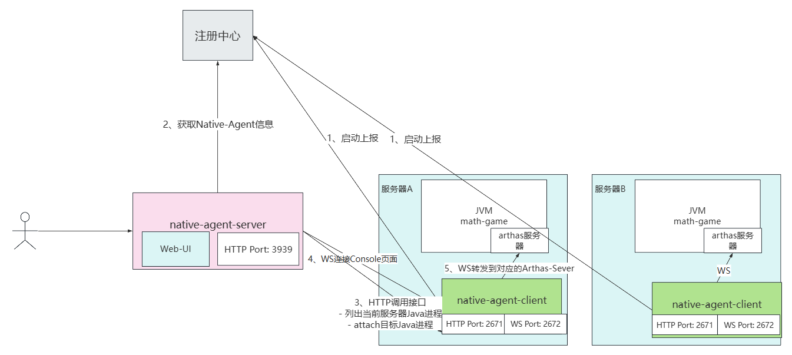
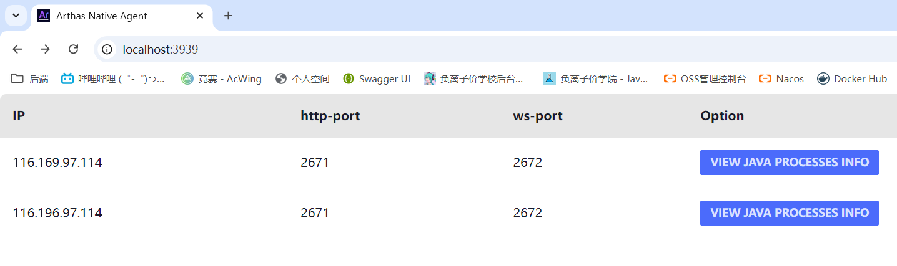
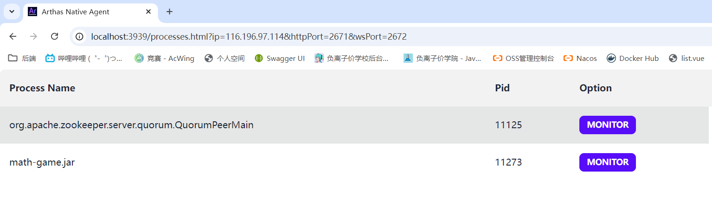

## Arthas Native Agent
 


# 快速开始

## 启动native-agent-client
native-agent-clinet，启动在需要动态attch的服务器上
启动参数
- http-port：非必填，http端口 ，默认2671
- ws-port: 非必填，ws端口，默认2672
- registration-type：必填，注册中心类型（目前实现的有etcd和zookeeper,推荐etcd）
- registration-address：必填，注册中心的地址

example：
```shell
java -jar native-agent-client.jar --ip 146.196.97.124 --http-port 2671 --ws-port 2672 --registration-type etcd --registration-address 146.196.97.124:2379
```

## 启动native-agent-server
native-agent-serve启动，有3个参数
- http的端口：非必填，http端口，默认是3939
- registration-type：必填，注册中心类型（目前实现的有etcd和zookeeper,推荐etcd）
- registration-address：必填，注册中心的地址

example：
```shell
java -jar native-agent-server.jar --http-port 3939 --registration-type zookeeper --registration-address 146.196.97.124:2379
```

## 监控指定JVM
进入native-agent-server管理页面，点击VIEW JAVA PROCESS INFO 按钮，可以查看到当前服务器上的Java进程

进入到Java进程页后，我们可以点击Monitor按钮，Monitor目标Java进程

之后点击MONITOR按钮就可以进入到监控界面了


# 扩展注册中心
目前实现的有zookeeper和etcd，如果想要扩展注册中心，需要对client和server都进行扩展，下面演示的是native-agent-client的扩展，native-agent-server也是同样的道理。

需要实现com.alibaba.arthas.nat.agent.client.cluster.NativeAgentClientRegistry接口，并在META-INF/arthas/com.alibaba.arthas.native.agent.client.NativeAgentClientRegistryFactory 添加上你的实现
```properties
zookeeper=com.alibaba.arthas.nat.agent.client.cluster.ZookeeperNativeAgentClientRegistry
etcd=com.alibaba.arthas.nat.agent.client.cluster.EtcdNativeAgentClientRegistry
```
# 添加你的实现
注册中心名称=你实现类的具体路径
之后你启动native-agent-client就可以，通过--registration-type参数，来指定你实现的注册中心
```shell
java -jar native-agent-client.jar --ip 116.196.97.114 --registration-type 注册中心名称 --registration-address 注册中心的地址
```
