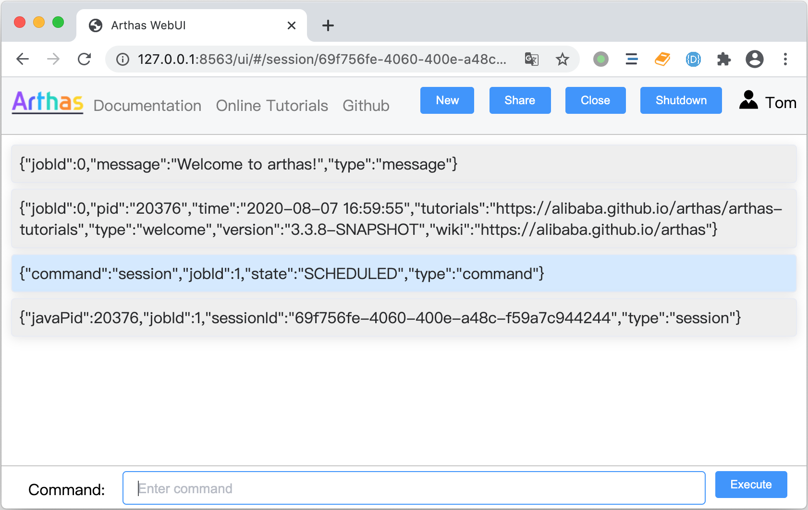

Http API
========

[`Http API`在线教程](https://arthas.aliyun.com/doc/arthas-tutorials.html?language=cn&id=case-http-api)

### 概览

Http API
提供类似RESTful的交互接口，请求和响应均为JSON格式的数据。相对于Telnet/WebConsole的输出非结构化文本数据，Http
API可以提供结构化的数据，支持更复杂的交互功能，比如特定应用场景的一系列诊断操作。


#### 访问地址

Http API接口地址为：`http://ip:port/api`，必须使用POST方式提交请求参数。如POST
`http://127.0.0.1:8563/api` 。

注意：telnet服务的3658端口与Chrome浏览器有兼容性问题，建议使用http端口8563来访问http接口。

#### 请求数据格式

```json
{
  "action": "exec",
  "requestId": "req112",
  "sessionId": "94766d3c-8b39-42d3-8596-98aee3ccbefb",
  "consumerId": "955dbd1325334a84972b0f3ac19de4f7_2",
  "command": "version",
  "execTimeout": "10000"
}
```
请求数据格式说明：

* `action` : 请求的动作/行为，可选值请参考"请求Action"小节。
*  `requestId` : 可选请求ID，由客户端生成。
*  `sessionId` : Arthas会话ID，一次性命令不需要设置会话ID。
*  `consumerId` : Arthas消费者ID，用于多人共享会话。
*  `command` : Arthas command line 。
*  `execTimeout` : 命令同步执行的超时时间(ms)，默认为30000。

注意: 不同的action使用到参数不同，根据具体的action来设置参数。

#### 请求Action

目前支持的请求Action如下： 

* `exec` : 同步执行命令，命令正常结束或者超时后中断命令执行后返回命令的执行结果。
*  `async_exec` : 异步执行命令，立即返回命令的调度结果，命令执行结果通过`pull_results`获取。
*  `interrupt_job` : 中断会话当前的命令，类似Telnet `Ctrl + c`的功能。
*  `pull_results` : 获取异步执行的命令的结果，以http 长轮询（long-polling）方式重复执行
*  `init_session` : 创建会话
*  `join_session` : 加入会话，用于支持多人共享同一个Arthas会话
*  `close_session` : 关闭会话

#### 响应状态

响应中的state属性表示请求处理状态，取值如下：

* `SCHEDULED`：异步执行命令时表示已经创建job并已提交到命令执行队列，命令可能还没开始执行或者执行中；
* `SUCCEEDED`：请求处理成功（完成状态）；
* `FAILED`：请求处理失败（完成状态），通常附带message说明原因；
* `REFUSED`：请求被拒绝（完成状态），通常附带message说明原因；

### 一次性命令

与执行批处理命令类似，一次性命令以同步方式执行。不需要创建会话，不需要设置`sessionId`选项。

```json
{
  "action": "exec",
  "command": "<Arthas command line>"
}
```

比如获取Arthas版本号：

```bash
curl -Ss -XPOST http://localhost:8563/api -d '
{
  "action":"exec",
  "command":"version"
}
'
```
响应内容如下：

```json
{
   "state" : "SUCCEEDED",
   "sessionId" : "ee3bc004-4586-43de-bac0-b69d6db7a869",
   "body" : {
      "results" : [
         {
            "type" : "version",
            "version" : "3.3.7",
            "jobId" : 5
         },
         {
            "jobId" : 5,
            "statusCode" : 0,
            "type" : "status"
         }
      ],
      "timeExpired" : false,
      "command" : "version",
      "jobStatus" : "TERMINATED",
      "jobId" : 5
   }
}
```
响应数据解析：

* `state`: 请求处理状态，参考“接口响应状态”说明
*  `sessionId `: Arthas会话ID，一次性命令自动创建及销毁临时会话
*  `body.jobId`:  命令的任务ID，同一任务输出的所有Result都是相同的jobId
*  `body.jobStatus`: 任务状态，同步执行正常结束为`TERMINATED `
*  `body.timeExpired`: 任务执行是否超时
* `body/results`: 命令执行的结果列表

**命令结果格式说明**

```json
 [{
    "type" : "version",
    "version" : "3.3.7",
    "jobId" : 5
 },
 {
    "jobId" : 5,
    "statusCode" : 0,
    "type" : "status"
 }]
```

* `type` : 命令结果类型，除了`status`等特殊的几个外，其它的保持与Arthas命令名称一致。请参考"[特殊命令结果](#special_command_results)"小节。
*  `jobId` : 处理命令的任务ID。
*  其它字段为每个不同命令的数据。

注意：也可以使用一次性命令的方式执行watch/trace等连续输出的命令，但不能中断命令执行，可能出现长时间没有结束的问题。请参考"[watch命令输出map对象](#change_watch_value_to_map)"小节的示例。

请尽量按照以下方式处理：

* 设置合理的`execTimeout`，到达超时时间后强制中断命令执行，避免长时间挂起。
* 通过`-n`参数指定较少的执行次数。
* 保证命令匹配的方法可以成功命中和condition-express编写正确，如果watch/trace没有命中就算指定`-n
  1`也会挂起等待到执行超时。

### 会话交互

由用户创建及管理Arthas会话，适用于复杂的交互过程。访问流程如下：

* 创建会话
* 加入会话(可选）
* 拉取命令结果
* 执行一系列命令
* 中断命令执行
* 关闭会话

#### 创建会话

```bash
curl -Ss -XPOST http://localhost:8563/api -d '
{
  "action":"init_session"
}
'
```
响应结果：

```json
{
   "sessionId" : "b09f1353-202c-407b-af24-701b744f971e",
   "consumerId" : "5ae4e5fbab8b4e529ac404f260d4e2d1_1",
   "state" : "SUCCEEDED"
}
```
当前会话ID为： `b09f1353-202c-407b-af24-701b744f971e`， 当前消费者ID为：`5ae4e5fbab8b4e529ac404f260d4e2d1_1 `。

#### 加入会话

指定要加入的会话ID，服务端将分配一个新的消费者ID。多个消费者可以接收到同一个会话的命令结果。本接口用于支持多人共享同一个会话或刷新页面后重新拉取会话历史记录。

```bash
curl -Ss -XPOST http://localhost:8563/api -d '
{
  "action":"join_session",
  "sessionId" : "b09f1353-202c-407b-af24-701b744f971e"
}
'
```
响应结果：

```json
{
   "consumerId" : "8f7f6ad7bc2d4cb5aa57a530927a95cc_2",
   "sessionId" : "b09f1353-202c-407b-af24-701b744f971e",
   "state" : "SUCCEEDED"
}
```
新的消费者ID为`8f7f6ad7bc2d4cb5aa57a530927a95cc_2 ` 。

#### 拉取命令结果

拉取命令结果消息的action为`pull_results`。请使用Http long-polling方式，定时循环拉取结果消息。
消费者的超时时间为5分钟，超时后需要调用`join_session`分配新的消费者。每个消费者单独分配一个缓存队列，按顺序拉取命令结果，不会影响到其它消费者。

请求参数需要指定会话ID及消费者ID:

```bash
curl -Ss -XPOST http://localhost:8563/api -d '
{
  "action":"pull_results",
  "sessionId" : "b09f1353-202c-407b-af24-701b744f971e",
  "consumerId" : "8f7f6ad7bc2d4cb5aa57a530927a95cc_2"
}
'
```

用Bash脚本定时拉取结果消息:

```bash
while true; do curl -Ss -XPOST http://localhost:8563/api -d '
{
  "action":"pull_results",
  "sessionId" : "2b085b5d-883b-4914-ab35-b2c5c1d5aa2a",
  "consumerId" : "8ecb9cb7c7804d5d92e258b23d5245cc_1"
}
' | json_pp; sleep 2; done
```
注： `json_pp` 工具将输出内容格式化为pretty json。

响应内容如下：

```json
{
   "body" : {
      "results" : [
         {
            "inputStatus" : "DISABLED",
            "jobId" : 0,
            "type" : "input_status"
         },
         {
            "type" : "message",
            "jobId" : 0,
            "message" : "Welcome to arthas!"
         },
         {
            "tutorials" : "https://arthas.aliyun.com/doc/arthas-tutorials.html",
            "time" : "2020-08-06 15:56:43",
            "type" : "welcome",
            "jobId" : 0,
            "pid" : "7909",
            "wiki" : "https://arthas.aliyun.com/doc",
            "version" : "3.3.7"
         },
         {
            "inputStatus" : "ALLOW_INPUT",
            "type" : "input_status",
            "jobId" : 0
         }
      ]
   },
   "sessionId" : "b09f1353-202c-407b-af24-701b744f971e",
   "consumerId" : "8f7f6ad7bc2d4cb5aa57a530927a95cc_2",
   "state" : "SUCCEEDED"
}

```


#### 异步执行命令

```bash
curl -Ss -XPOST http://localhost:8563/api -d '''
{
  "action":"async_exec",
  "command":"watch demo.MathGame primeFactors \"{params, returnObj, throwExp}\" ",
   "sessionId" : "2b085b5d-883b-4914-ab35-b2c5c1d5aa2a"
}
'''
```

`async_exec` 的结果：

```json
{
   "sessionId" : "2b085b5d-883b-4914-ab35-b2c5c1d5aa2a",
   "state" : "SCHEDULED",
   "body" : {
      "jobStatus" : "READY",
      "jobId" : 3,
      "command" : "watch demo.MathGame primeFactors \"{params, returnObj, throwExp}\" "
   }
}
```

* `state` : `SCHEDULED` 状态表示已经解析命令生成任务，但未开始执行。
* `body.jobId` :
  异步执行命令的任务ID，可以根据此任务ID来过滤在`pull_results`输出的命令结果。
* `body.jobStatus` : 任务状态`READY`表示未开始执行。


查看上面自动拉取结果消息脚本的shell输出：

```json
{
   "body" : {
      "results" : [
         {
            "type" : "command",
            "jobId" : 3,
            "state" : "SCHEDULED",
            "command" : "watch demo.MathGame primeFactors \"{params, returnObj, throwExp}\" "
         },
         {
            "inputStatus" : "ALLOW_INTERRUPT",
            "jobId" : 0,
            "type" : "input_status"
         },
         {
            "success" : true,
            "jobId" : 3,
            "effect" : {
               "listenerId" : 3,
               "cost" : 24,
               "classCount" : 1,
               "methodCount" : 1
            },
            "type" : "enhancer"
         },
         {
            "sizeLimit" : 10485760,
            "expand" : 1,
            "jobId" : 3,
            "type" : "watch",
            "cost" : 0.071499,
            "ts" : 1596703453237,
            "value" : [
               [
                  -170365
               ],
               null,
               {
                  "stackTrace" : [
                     {
                        "className" : "demo.MathGame",
                        "classLoaderName" : "app",
                        "methodName" : "primeFactors",
                        "nativeMethod" : false,
                        "lineNumber" : 46,
                        "fileName" : "MathGame.java"
                     },
                     ...
                  ],
                  "localizedMessage" : "number is: -170365, need >= 2",
                  "@type" : "java.lang.IllegalArgumentException",
                  "message" : "number is: -170365, need >= 2"
               }
            ]
         },
         {
            "type" : "watch",
            "cost" : 0.033375,
            "jobId" : 3,
            "ts" : 1596703454241,
            "value" : [
               [
                  1
               ],
               [
                  2,
                  2,
                  2,
                  2,
                  13,
                  491
               ],
               null
            ],
            "sizeLimit" : 10485760,
            "expand" : 1
         }
      ]
   },
   "consumerId" : "8ecb9cb7c7804d5d92e258b23d5245cc_1",
   "sessionId" : "2b085b5d-883b-4914-ab35-b2c5c1d5aa2a",
   "state" : "SUCCEEDED"
}
```

watch命令结果的`value`为watch-experss的值，上面命令中为`{params, returnObj,
throwExp}`，所以watch结果的value为一个长度为3的数组，每个元素分别对应相应顺序的表达式。
请参考"[watch命令输出map对象](#change_watch_value_to_map)"小节。

#### 中断命令执行

中断会话正在运行的前台Job（前台任务）：

```bash
curl -Ss -XPOST http://localhost:8563/api -d '''
{
  "action":"interrupt_job",
  "sessionId" : "2b085b5d-883b-4914-ab35-b2c5c1d5aa2a"
}
'''
```

```
{
   "state" : "SUCCEEDED",
   "body" : {
      "jobStatus" : "TERMINATED",
      "jobId" : 3
   }
}
```

#### 关闭会话
指定会话ID，关闭会话。

```bash
curl -Ss -XPOST http://localhost:8563/api -d '''
{
  "action":"close_session",
  "sessionId" : "2b085b5d-883b-4914-ab35-b2c5c1d5aa2a"
}
'''
```

```json
{
   "state" : "SUCCEEDED"
}
```

### 鉴权

参考： [auth](auth.md)

### Web UI



一个基于Http API接口实现的Web UI，访问地址为： [http://127.0.0.1:8563/ui](http://127.0.0.1:8563/ui) 。

已实现功能：

* 创建会话
* 复制并打开url加入会话，多人共享会话
* 周期性拉取会话命令结果消息
* 刷新页面或者加入会话拉取会话历史命令消息
* 输入命令/中断命令状态控制

待开发功能：

* 改进将命令结果消息可读性
* 命令输入支持自动完成及命令模板
* 提供命令帮助
* 支持个人选项设置

<a id="special_command_results"></a>
### 特殊命令结果

#### status

```json
{
    "jobId" : 5,
    "statusCode" : 0,
    "type" : "status"
}
```
`type`为`status`表示命令执行状态：

每个命令执行结束后都有唯一一个status结果。`statusCode`
为0表示执行成功，`statusCode` 为非0值表示执行失败，类似进程退出码(exit code)。

命令执行失败时一般会提供错误消息，如：

```json
{
  "jobId":3,
  "message":"The argument 'class-pattern' is required",
  "statusCode":-10,
  "type":"status"
}
```

#### input_status

```json
 {
    "inputStatus" : "ALLOW_INPUT",
    "type" : "input_status",
    "jobId" : 0
 }
```

`type`为`input_status`表示输入状态：

用于UI交互时控制用户输入，每次执行命令前后会发送改变的消息。
`inputStatus` 的值说明：

* `ALLOW_INPUT` :
  允许用户输入命令，表示会话没有在执行的前台命令，可以接受新的命令。
* `ALLOW_INTERRUPT` :
  允许用户中断命令执行，表示当前正在执行命令，用户可以发送`interrupt_job`中断执行。
* `DISABLED` : 禁用状态，不能输入命令也不能中断命令。


#### command

```json
 {
    "type" : "command",
    "jobId" : 3,
    "state" : "SCHEDULED",
    "command" : "watch demo.MathGame primeFactors \"{params, returnObj, throwExp}\" "
 }
```
`type` 为`command`表示输入的命令数据：

用于交互UI回显用户输入的命令，拉取的会话命令消息历史会包含`command`类型的消息，按顺序处理即可。


#### enhancer

```json
 {
    "success" : true,
    "jobId" : 3,
    "effect" : {
       "listenerId" : 3,
       "cost" : 24,
       "classCount" : 1,
       "methodCount" : 1
    },
    "type" : "enhancer"
 }
```
`type`为`enhancer`表示类增强结果：

`trace/watch/jad/tt`等命令需要对类进行增强，会接收到这个`enhancer`结果。可能出现`enhancer`结果成功，但没有命中方法的情况，客户端可以根据`enhancer`结果提示用户。

### 案例

#### 获取Java应用的Classpath

通过Http api查询Java应用的System properties，提取`java.class.path`的值。


```bash
json_data=$(curl -Ss -XPOST http://localhost:8563/api -d '
{
  "action":"exec",
  "command":"sysprop"
}')
```

* 使用`sed`提取值：

```bash
class_path=$(echo $json_data | tr -d '\n' | sed 's/.*"java.class.path":"\([^"]*\).*/\1/')
echo "classpath: $class_path"
```

* 使用`json_pp/awk`提取值

```bash
class_path=$(echo $json_data | tr -d '\n' | json_pp | grep java.class.path | awk -F'"' '{ print $4 }')
echo "classpath: $class_path"
```

输出内容：

```
classpath: demo-arthas-spring-boot.jar
```

注意：

* `echo $json_data | tr -d '\n'` :  删除换行符(`line.separator`的值)，避免影响`sed`/`json_pp`命令处理。
* `awk -F'"' '{ print $4 }'` : 使用双引号作为分隔符号


<a id="change_watch_value_to_map"></a>
#### watch命令输出map对象

watch的结果值由计算`watch-express` ognl表达式产生，可以通过改变ognl表达式来生成想要的值，请参考[OGNL文档](https://commons.apache.org/proper/commons-ognl/language-guide.html)。

> Maps can also be created using a special syntax.
>
>#{ "foo" : "foo value", "bar" : "bar value" }
>
>This creates a Map initialized with mappings for "foo" and "bar".

下面的命令生成map格式的值：

```bash
watch *MathGame prime* '#{ "params" : params, "returnObj" : returnObj, "throwExp": throwExp}' -x 2 -n 5
```

在Telnet shell/WebConsole 中执行上面的命令，输出的结果：

```bash
ts=2020-08-06 16:57:20; [cost=0.241735ms] result=@LinkedHashMap[
    @String[params]:@Object[][
        @Integer[1],
    ],
    @String[returnObj]:@ArrayList[
        @Integer[2],
        @Integer[241],
        @Integer[379],
    ],
    @String[throwExp]:null,
]
```

用Http api 执行上面的命令，注意对JSON双引号转义：

```bash
curl -Ss -XPOST http://localhost:8563/api -d @- << EOF
{
  "action":"exec",
  "execTimeout": 30000,
  "command":"watch *MathGame prime* '#{ \"params\" : params, \"returnObj\" : returnObj, \"throwExp\": throwExp}' -n 3 "
}
EOF
```

Http api 执行结果：

```json
{
    "body": {
         ...
        "results": [
            ...
            {
                ...
                "type": "watch",
                "value": {
                    "params": [
                        1
                    ],
                    "returnObj": [
                        2,
                        5,
                        17,
                        23,
                        23
                    ]
                }
            },
            {
                ...
                "type": "watch",
                "value": {
                    "params": [
                        -98278
                    ],
                    "throwExp": {
                        "@type": "java.lang.IllegalArgumentException",
                        "localizedMessage": "number is: -98278, need >= 2",
                        "message": "number is: -98278, need >= 2",
                        "stackTrace": [
                            ...
                        ]
                    }
                }
            },
            ...
}
```

可以看到watch结果的value变成map对象，程序可以通过key读取结果。


