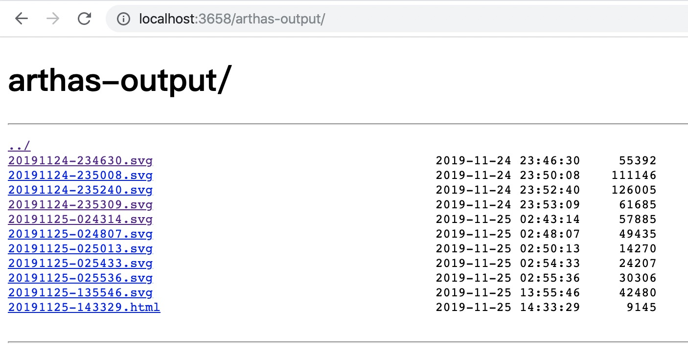
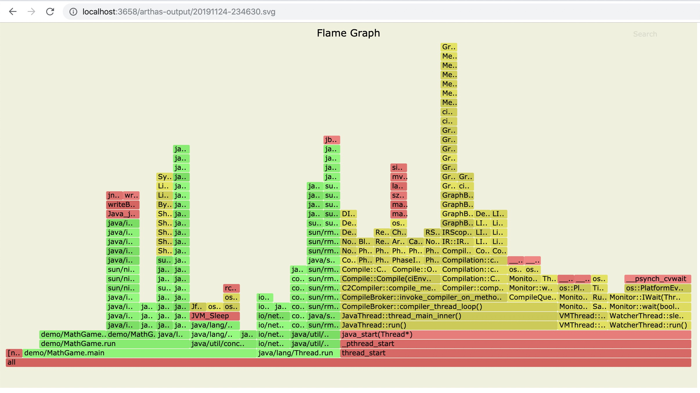

profiler
===

[`profiler`在线教程](https://arthas.aliyun.com/doc/arthas-tutorials.html?language=cn&id=command-profiler)

> 使用[async-profiler](https://github.com/jvm-profiling-tools/async-profiler)生成火焰图

`profiler` 命令支持生成应用热点的火焰图。本质上是通过不断的采样，然后把收集到的采样结果生成火焰图。

`profiler` 命令基本运行结构是 `profiler action [actionArg]`

### 参数说明

|参数名称|参数说明|
|---:|:---|
|*action*|要执行的操作|
|*actionArg*|属性名模式|
|[i:]|采样间隔（单位：ns）（默认值：10'000'000，即10 ms）|
|[f:]|将输出转储到指定路径|
|[d:]|运行评测指定秒|
|[e:]|要跟踪哪个事件（cpu, alloc, lock, cache-misses等），默认是cpu|

### 启动profiler


```
$ profiler start
Started [cpu] profiling
```

> 默认情况下，生成的是cpu的火焰图，即event为`cpu`。可以用`--event`参数来指定。


### 获取已采集的sample的数量

```
$ profiler getSamples
23
```

### 查看profiler状态

```bash
$ profiler status
[cpu] profiling is running for 4 seconds
```

可以查看当前profiler在采样哪种`event`和采样时间。

### 停止profiler

#### 生成svg格式结果

```
$ profiler stop
profiler output file: /tmp/demo/arthas-output/20191125-135546.svg
OK
```

默认情况下，生成的结果保存到应用的`工作目录`下的`arthas-output`目录。可以通过 `--file`参数来指定输出结果路径。比如：

```bash
$ profiler stop --file /tmp/output.svg
profiler output file: /tmp/output.svg
OK
```

#### 生成html格式结果

默认情况下，结果文件是`svg`格式，如果想生成`html`格式，可以用`--format`参数指定：

```bash
$ profiler stop --format html
profiler output file: /tmp/test/arthas-output/20191125-143329.html
OK
```

或者在`--file`参数里用文件名指名格式。比如`--file /tmp/result.html` 。


### 通过浏览器查看arthas-output下面的profiler结果

默认情况下，arthas使用3658端口，则可以打开： [http://localhost:3658/arthas-output/](http://localhost:3658/arthas-output/) 查看到`arthas-output`目录下面的profiler结果：



点击可以查看具体的结果：



> 如果是chrome浏览器，可能需要多次刷新。

### profiler支持的events

在不同的平台，不同的OS下面，支持的events各有不同。比如在macos下面：

```bash
$ profiler list
Basic events:
  cpu
  alloc
  lock
  wall
  itimer
```

在linux下面

```bash
$ profiler list
Basic events:
  cpu
  alloc
  lock
  wall
  itimer
Perf events:
  page-faults
  context-switches
  cycles
  instructions
  cache-references
  cache-misses
  branches
  branch-misses
  bus-cycles
  L1-dcache-load-misses
  LLC-load-misses
  dTLB-load-misses
  mem:breakpoint
  trace:tracepoint
```

如果遇到OS本身的权限/配置问题，然后缺少部分event，可以参考`async-profiler`本身文档：[async-profiler](https://github.com/jvm-profiling-tools/async-profiler)

可以用`--event`参数指定要采样的事件，比如对`alloc`事件进入采样：

```bash
$ profiler start --event alloc
```


### 恢复采样

```bash
$ profiler resume
Started [cpu] profiling
```

`start`和`resume`的区别是：`start`是新开始采样，`resume`会保留上次`stop`时的数据。

通过执行`profiler getSamples`可以查看samples的数量来验证。


### 使用`execute`来执行复杂的命令

比如开始采样：

```bash
profiler execute 'start,framebuf=5000000'
```

停止采样，并保存到指定文件里：

```bash
profiler execute 'stop,file=/tmp/result.svg'
```

具体的格式参考： [arguments.cpp](https://github.com/jvm-profiling-tools/async-profiler/blob/v1.8.1/src/arguments.cpp#L50)

### 查看所有支持的action

```bash
$ profiler actions
Supported Actions: [resume, dumpCollapsed, getSamples, start, list, execute, version, stop, load, dumpFlat, actions, dumpTraces, status]
```


### 查看版本

```bash
$ profiler version
Async-profiler 1.6 built on Sep  9 2019
Copyright 2019 Andrei Pangin
```

### 配置 framebuf 参数

> 如果遇到生成的svg图片有 `[frame_buffer_overflow]`，则需要增大 framebuf（默认值是 1'000'000），可以显式配置，比如：

```bash
profiler start --framebuf 5000000
```

### 配置 include/exclude 来过滤数据

如果应用比较复杂，生成的内容很多，想只关注部分数据，可以通过 include/exclude 来过滤。比如

```bash
profiler start --include 'java/*' --include 'demo/*' --exclude '*Unsafe.park*'
```

> include/exclude 都支持设置多个值 ，但是需要配置在命令行的最后。


### 指定执行时间

比如，希望profiler执行 300 秒自动结束，可以用 `-d`/`--duration` 参数指定：

```bash
profiler start --duration 300
```

### 生成 jfr格式结果

> 注意，jfr只支持在 `start`时配置。如果是在`stop`时指定，则不会生效。

```
profiler start --file /tmp/test.jfr
```

`file`参数支持一些变量：

* 时间戳： `--file /tmp/test-%t.jfr`
* 进程ID： `--file /tmp/test-%p.jfr`


生成的结果可以用支持jfr格式的工具来查看。比如：

* JDK Mission Control ： https://github.com/openjdk/jmc
* JProfiler ： https://github.com/alibaba/arthas/issues/1416


### 生成的火焰图里的 unknown

* https://github.com/jvm-profiling-tools/async-profiler/discussions/409
