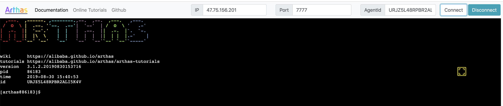

Arthas Tunnel
===

通过Arthas Tunnel Server/Client 来远程管理/连接多个Agent。

比如，在流式计算里，Java进程可以是在不同的机器启动的，想要使用Arthas去诊断会比较麻烦，因为用户通常没有机器的权限，即使登陆机器也分不清是哪个Java进程。

在这种情况下，可以使用Arthas Tunnel Server/Client。

参考: 
* [Web Console](web-console.md)
* [Arthas Spring Boot Starter](spring-boot-starter.md)

### 下载部署arthas tunnel server

[https://github.com/alibaba/arthas/releases](https://github.com/alibaba/arthas/releases)

* 从Maven仓库下载：[](https://arthas.aliyun.com/download/arthas-tunnel-server/latest_version?mirror=aliyun)

* 从Github Releases页下载： [https://github.com/alibaba/arthas/releases](https://github.com/alibaba/arthas/releases)


Arthas tunnel server是一个spring boot fat jar应用，直接`java -jar`启动：

```bash
java -jar  arthas-tunnel-server.jar
```

默认情况下，arthas tunnel server的web端口是`8080`，arthas agent连接的端口是`7777`。

启动之后，可以访问 [http://127.0.0.1:8080/](http://127.0.0.1:8080/) ，再通过`agentId`连接到已注册的arthas agent上。

通过Spring Boot的Endpoint，可以查看到具体的连接信息： [http://127.0.0.1:8080/actuator/arthas](http://127.0.0.1:8080/actuator/arthas) ，登陆用户名是`arthas`，密码在arthas tunnel server的日志里可以找到，比如：

```
32851 [main] INFO  o.s.b.a.s.s.UserDetailsServiceAutoConfiguration

Using generated security password: f1dca050-3777-48f4-a577-6367e55a78a2
```

### 启动arthas时连接到tunnel server

在启动arthas，可以传递`--tunnel-server`参数，比如：

```bash
as.sh --tunnel-server 'ws://127.0.0.1:7777/ws'
```

也可以使用下面的测试地址（不保证一直可用）：

```bash
as.sh --tunnel-server 'ws://47.75.156.201:80/ws'
```

* 如果有特殊需求，可以通过`--agent-id`参数里指定agentId。默认情况下，会生成随机ID。


attach成功之后，会打印出agentId，比如：

```bash
  ,---.  ,------. ,--------.,--.  ,--.  ,---.   ,---.
 /  O  \ |  .--. ''--.  .--'|  '--'  | /  O  \ '   .-'
|  .-.  ||  '--'.'   |  |   |  .--.  ||  .-.  |`.  `-.
|  | |  ||  |\  \    |  |   |  |  |  ||  | |  |.-'    |
`--' `--'`--' '--'   `--'   `--'  `--'`--' `--'`-----'


wiki      https://arthas.aliyun.com/doc
tutorials https://arthas.aliyun.com/doc/arthas-tutorials.html
version   3.1.2
pid       86183
time      2019-08-30 15:40:53
id        URJZ5L48RPBR2ALI5K4V
```

如果是启动时没有连接到 tunnel server，也可以在后续自动重连成功之后，通过 session命令来获取 agentId：

```bash
[arthas@86183]$ session
 Name           Value
-----------------------------------------------------
 JAVA_PID       86183
 SESSION_ID     f7273eb5-e7b0-4a00-bc5b-3fe55d741882
 AGENT_ID       URJZ5L48RPBR2ALI5K4V
 TUNNEL_SERVER  ws://47.75.156.201:80/ws
```


以上面的为例，在浏览器里访问 [http://47.75.156.201/arthas/?port=80](http://47.75.156.201/arthas/?port=80) ，输入 `agentId`，就可以连接到本机上的arthas了。





### 最佳实践

> 注意，agentId要保持唯一，否则会在tunnel server上冲突，不能正常工作。

如果 arthas agent配置了 `appName`，则生成的agentId会带上`appName`的前缀。

比如在加上启动参数：`as.sh --tunnel-server 'ws://127.0.0.1:7777/ws' --app-name demoapp` ，则生成的agentId可能是`demoapp_URJZ5L48RPBR2ALI5K4V`。

Tunnel server会以`_`做分隔符，提取出`appName`，方便按应用进行管理。

> 另外，也可以在解压的arthas目录下的 `arthas.properties`，或者在spring boot应用的`application.properties`里配置`appName`。


### 集群方式管理

如果希望部署多台 tunnel server，可以通过nginx做转发，redis来保存agent信息。


### Arthas tunnel server的工作原理

```
browser <-> arthas tunnel server <-> arthas tunnel client <-> arthas agent
```

[tunnel-server/README.md](https://github.com/alibaba/arthas/blob/master/tunnel-server/README.md#)
