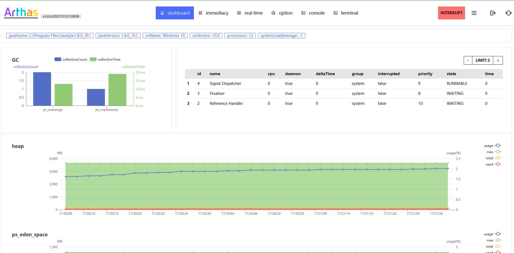
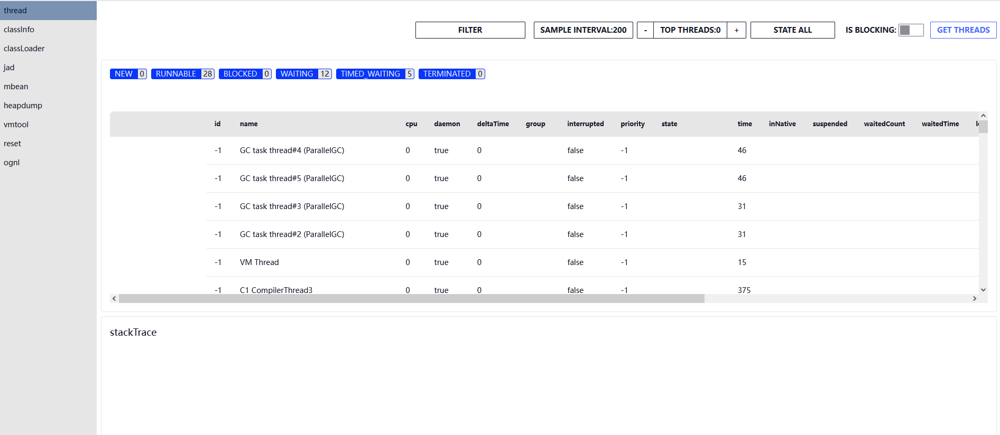
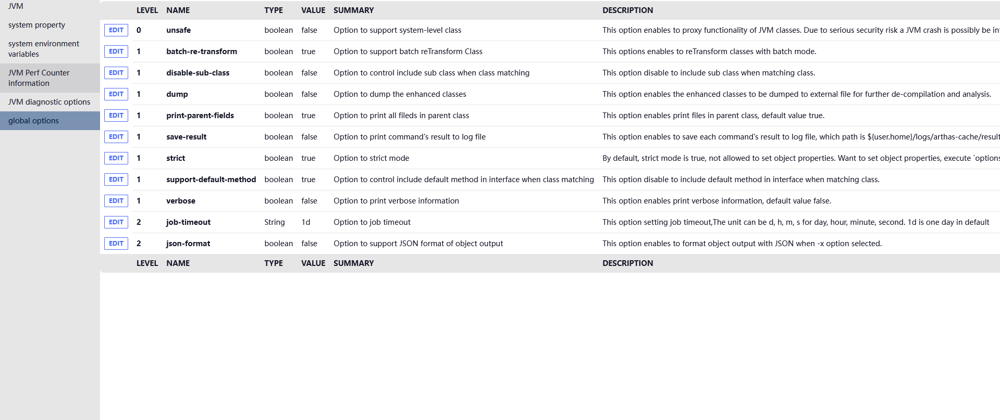

# 基于 http api 的 可视化 arthas 页面

[English](./README.md)|[中文](README_ZH.md)

## usage

- 当你遇到奇怪的问题，可以通过刷新网页解决
- 有一些命令需要使用 sessionID ，有些不需要。不过在目前的版本中，在使用时不需要控制 sessionid 。如有必要，通过点击右上角的按钮获取 / 销毁 sessionID
- 当出现 interrupt 的红色按钮时，代表你进入了轮询的状态（dashboard 还有 real time 里经常出现）。当不想用当前功能，通过点击该按钮来停止当前的轮询
- 路径：/index.html (原版的 web terminal), /ui/index.html (新版的可视化界面)
- 每个功能和cli命令同名，具体的功能可以通过看官方文档（点击arthas图标可以跳转到官方文档）

### 模块介绍

#### dashboard



- 基于 dashboard 命令实现
- 折线图展示 memory 的各种信息，
- 柱状图展示 gc 数据 (可能用折线配合时间轴会更好？)
- 表格展示 threads 信息， limit 控制展示前 n 忙的线程

#### real time

- 监控用的功能， 需要sessionID
- `tt`, `monitor` 使用折线图展示了cost/RT

##### tt

- all records 翻出所有的记录
- 在表格中根据 index 找到需要的记录，可以通过点击invoke触发那次调用，
- search records 用Advice 对象翻查，如`method.name=="print"`

#### immediacy

- 一发送就有响应的命令， 不需要 sessionID
- 有一部分功能提供了 refresh 用来手动更新

##### thread



- thread 应该可以实时的，为了不污染 history 和 减少后端压力，选择了用户手动点击get threads 来实现当前的thread状况

###### filter: 提供了过滤功能

```shell
列名:值

例如:
  id:-1 // 此时是会过滤出一切id = -1 的行
```

- 允许多个列的过滤，目前仅支持 `=`
- ~~具体实现比较粗糙，可能会有奇怪的bug~~

###### top thread

- 控制要显示前几个忙的线程
- 0 代表不限制

#### option



- 简单的展示配置
- 提供一些配置的修改（不保证安全，允许类似修改osName这种操作）

#### console

- 一般不会用，调试 http api 用的
- 已经自动 init sessionID 了

#### terminal

- 直接跳到基于 websocket 的 Web 终端

## 开发

- 墙裂推荐用 vscode 开发, 可以用 vscode 的 xstate 插件查看请求数据的状态图
- TS + Vue3 + Tailwindcss  + daisyui + xstate
- 打包先打到dist, 再通过 ant 复制到  `../target/static`

### 注意事项

- 当使用 pull_results ，不要使用其他的命令，例如 ```sc class```
- consoleMachine.ts 以后会被 perRequestMachine.ts 完全取代，@vue/state这个依赖后续也会删除掉

### 接下来的目标

- [ ] 无法量化的数据暂时是用表格展示， 还需要结合用户经验去设计可视化方案
- [ ] 代码的组织还是比较糟糕
